# *uPlan*, by Noēma

Term project done for CMPT 370 at the University of Saskatchewan.

Team Members:

- Kohlton Booth
- Braden Dubois
- Jenni Just
- Alex Mowat
- Martin Thingvold

# Table of Contents
[Requirements](#Requirements)

[Setup](#Setup)

[Running](#Running)

[Troubleshooting](#Troubleshooting)

[Documentation](#Documentation)

[Acknowledgements](#acknowledgements)

# Marker Setup

The steps described here do little more than set up port forwarding from your own machine to the Virtual Machine.

First enter tuxworld with
```shell script
ssh nsid@tux7.usask.ca
```

Now we set up a port forward from tuxworld to the virtual machine with
```shell script
ssh -N -f -L 3000:localhost:3000 user@CMPT370g3.usask.ca
ssh -N -f -L 8000:localhost:8000 user@CMPT370g3.usask.ca
```
These command might fail if someone else is port forwarding to tuxworld at the same time. This is most likely because someone in our project is already doing that however that's okay because it actually makes this step unnecessary!

Now exit away from tuxworld with ``exit`` and set up port forwarding from your machine to tuxworld.
```shell script
ssh -N -f -L 3000:localhost:3000 nsid@tux7.usask.ca
ssh -N -f -L 8000:localhost:8000 nsid@tux7.usask.ca
```
Where "nsid" is replaced with your own nsid. For this command you will need to supply your university password to get into tux7.

Once again enter your university password to access tuxworld. Now that that is done you can access the website in your browser by going to ``localhost:3000``


### Clean Up
This section stops the port forwards that we just set up.

First we close the port forward on your local machine to tuxworld. To do this we figure out the process id (PID) that our ssh command has. This is done with:
```shell script
ps aux | grep "ssh -N -f -L 3000:localhost:3000"
ps aux | grep "ssh -N -f -L 8000:localhost:8000"
```
The process we want to stop is the one that matches most closely to the command we did above in the set up. Take note of the PID which is the second column of the output. Knowing both of those PIDs we kill them with
```shell script
kill PID
```

Now SSH into tuxworld and do the same thing as above with the following. Note: If the first step of setting up the port forward failed then this is unnecessary, and potentially even **dangerous**. 
```shell script
ssh nsid@tuxworld.usask.ca
ps aux | grep "ssh -N -f -L 3000:localhost:3000"
ps aux | grep "ssh -N -f -L 8000:localhost:8000"
kill PID
```

With that we have shut down all the process we have created


# Viewing

This section outlines the process of preparing and running the project to view it; suitable for TAs, markers, presentations, etc.

## Requirements (Viewing)

The front-end is built on [React.js](https://reactjs.org/); therefore, you will need JavaScript enabled in your browser.

[Docker](https://docker.com/) is also required. 
* See [here](https://docs.docker.com/install/) for instructions getting Docker set up on your machine.
* To install on Ubuntu, see [here](https://docs.docker.com/install/linux/docker-ce/ubuntu/).
 
## Setup (Viewing)

## Viewing Through the Virtual Machine

The steps described here do little more than set up port forwarding from your own machine to the Virtual Machine.

This is the simplest way to view the project. It is this convenient because the Virtual Machine is always running the server.

First set up port forwarding from your machine to tuxworld.
```shell script
ssh -N -f -L 3000:localhost:3000 nsid@tuxworld.usask.ca
```
Where "nsid" is replaced with your own nsid. For this command you will need to supply your university password to get into tuxworld.

Now enter tuxworld with
```shell script
ssh nsid@tuxworld.usask.ca
```
As before you will need to supply your university password to get into tuxworld.

Now we set up a port forward from tuxworld to the virtual machine with
```shell script
ssh -N -f -L 3000:localhost:3000 user@CMPT370g3.usask.ca
```
For this command you will need to supply the "user" password for the VM which can be seen either on our discord server, but will also be supplied to the markers of our project in a way that is to be determined.

Once again enter your university password to access tuxworld. Now that that is done you can access the website in your browser by going to ``localhost:3000``


### Clean Up
When you want to stop viewing the website you will find that port 3000 of localhost may be taken up. To stop that from happening you will need to stop the port forwards we set up before. This section describes who to do that.

First we close the port forward on your local machine to tuxworld. To do this we figure out the process id (PID) that our ssh command has. This is done with:
```shell script
ps aux | grep "ssh -N -f -L 3000:localhost:3000"
```
The process we want to stop is the one that matches most closely to the command we did above in the set up. Take note of the PID which is the second column of the output. Knowing that PID we kill it with
```shell script
kill PID
```

Now do the same thing with tuxworld. SSH into tuxworld like we've done before and do the same thing with
```shell script
ssh nsid@tuxworld.usask.ca
ps aux | grep "ssh -N -f -L 3000:localhost"
kill PID
```

With that we have shut down all the process we have created


## Viewing Without the Virtual Machine

Before the website is to be run, we will need to set a few things up with docker, and the database. To initialize docker, and do some minimal database set up, run:

```shell script
sudo docker-compose run web python manage.py migrate
```

If this is your first time running this command, then it will take some time to complete; this is because docker will need to set up the required images.

Next, we need to populate the database. Run the following command:
```shell script
sudo docker-compose run web python manage.py loadData
```

Since the database is rather large, this will also take some time to set up. 

**Note**" *If this command ends on an error, saying ``index out of range``, then it still worked.* 

If this process is interrupted, any changes made to the database can be undone by re-running the previous command, replacing ``loadData`` with ``deleteData``.

## Running (Viewing)

Once the database is initialized we can start all of the necessary servers with the following command:
```shell script
sudo docker-compose up
```

After this is done, the web-page can be accessed by opening the web-page ``localhost:3000`` in a browser.

**Note**: If running successfully, your terminal running the Docker container will indicate the following:

```md
INFO: Accepting connections at http://localhost:80
```

This is not an error: ports are mapped (in the following command: ``3000:80``); view the page at ``http://localhost:3000/``, not ``http://localhost:80/``.

### Stopping the Docker Container 

Assuming the Docker container is currently running, the user can stop the container by entering ^C (that is, CTRL + C) in the terminal running the container.
Docker will indicate: ``INFO: Gracefully shutting down. Please wait...``.

# Running

This section concerns deploying the docker container, or running the project with Node. 

## Running the Docker Container

*Assuming the image has been built (see: [Setup](#Setup))*

Run:

```dockerfile
sudo docker run -p 3000:80 uplan
```

Now, the user can go to http://localhost:3000/ in a browser, to see the page running.

**Note**: If running successfully, your terminal running the Docker container will indicate the following:

```md
INFO: Accepting connections at http://localhost:80
```

This is not an error: ports are mapped (in the following command: ``3000:80``); view the page at ``http://localhost:3000/``, not ``http://localhost:80/``.

## Run the React Server

These steps concern running the project in development mode.

*This step assumes you have **installed node modules with ``npm install`` or ``yarn install`` already***.

Navigate to the ``react`` folder:
```shell_script
cd react
```

Run ``npm start`` or ``yarn start`` to run the app in the development mode; view it at [http://localhost:3000](http://localhost:3000) in a browser.

The page will reload if you make edits. You will also see any lint errors in the console.

## Run the Backend Server

The (still in development) way of running the backend is entirely through docker-compose.

The first step is to navigate to the newDjango directory and run the following commands:
To initilize the database:
```bash
sudo docker-compose run web python manage.py migrate
```
To get the data in the database: (this step will take awhile. If this crashes with an index out of range error then it still worked just not completly)
```bash
sudo docker-compose run web python manage.py loadData
```
To start the server:
```bash
sudo docker-compose up
```

## Stopping the Docker Container

Assuming the Docker container is currently running, the user can stop the container in one of two ways.

1. Press ^C (that is, CTRL + C) in the terminal running the container. Docker will indicate: ``INFO: Gracefully shutting down. Please wait...``.
2. In a *separate* terminal, perform the following:

See running Docker contains:
```shell script
docker ps
```

Find the column labelled ``IMAGE``, and the row with an ``IMAGE`` name of *uplan*. The right-most column, labelled ``NAMES`` will have a name that typically reads as <adjective_noun>. Identify this value, of the entry with an ``IMAGE`` name of *uplan*.

Run the following command, substituting <name> with the value identified in the previous step:
```shell script
docker stop <name>
```

The container should now be stopped.# Documentation

## Updating Documentation

The README is built from the individual markdown files in the the folder ``documentation``. To update the README, edit any of the files in the ``documentation`` folder, and then run the shell script (also located in the ``documentation`` folder):
```shell script
sh ./documentation/generate_readme.sh
```

## React

You can learn more in the [Create React App documentation](https://facebook.github.io/create-react-app/docs/getting-started).

To learn React, check out the [React documentation](https://reactjs.org/).

## Docker

To learn more about Docker, see their [guide](https://docs.docker.com/). 

## Django

To learn more about Django check out their [Documentation](https://docs.djangoproject.com/en/3.0/)

# Tests

# Front End Testing

## Out of system links
Tests Low Priority User Stories 5 and 6
These tests must all be run from starting at the home screen

**Test this**: Academic advisor button.   
1. Click the green button on the top of the page labeled "Academic Advisor"
 
**Expect this**: 
The website: https://students.usask.ca/academics/advisors.php#Undergraduateadvisors should be opened in a new tab.

**Test this**: Browse Programs Button for default program window
1. Click "Begin a new Schedule Entry"
2. Enter a name and click "Save Schedule"
2. Scroll down till you see the program searcher.
2. Click the green button labeled "Browse Programs"
 
**Expect this**: 
The website: https://admissions.usask.ca/programs/find-a-program.php#Programs should be opened in a new tab.

**Test this**: Link to Github page
1. Find the text: "Made by Noema" at the bottom of the page
2. Click the highlighted text "Noema"

**Expect this**: 
The website: https://git.cs.usask.ca/brd171/370-project should be opened in a new tab.

## Searching For Classes 
Partial Testing for High Priority User Story 1 and Medium Priority User Story 4
Theses tests can be run one after the other without going back to the default page inbetween 

This is the search box: It may be gray instead of black
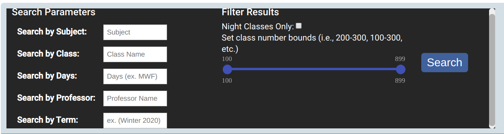

This is the results box:
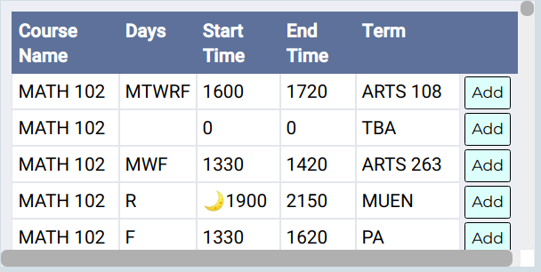

**Test this**: Searching with all empty fields
1. From the starter page, locate the search box in the upper left hand part of the screen.
2. Make sure no feilds are filled
3. Click the blue search button

**Expect this**: 
The first 100 of all the classes will show up in the results box starting with "ACB 221"

**Test this**: Searching for COMM night classes only
1.  In the search box, find the option for "Night Classes Only" under the "Filter Results" heading
2. In the subject field type "comm"

**Expect this**: 
In the results box 11 COMM classes should show up all with the little moon symbol.

**Test this**: Searching with subject only to find math classes
1. Remove the night class toggle from the last two tests
2. In the search box, type 'math' into the subject search feild  
3. Click Search

**Expect this**: 
In the results box 100 math classes from 102 to 110 show up. The results are limited to 100 classes to not overwhelm the user. Each class must have a course name. Some will not have all fields filled out. This is for classes with a TBA in the term feild or for classes off campus (ie they have SWIF = swift current in the term field). All entries under the day column should only have the letters M,T,W,R,F, S, U or an in order combination of them. Start times should always come before end times and both should be in 24 time. 

**Test this**: Searching with a subject that does not exist
1. In the search box change 'math' to 'maths'
2. Click Search

**Expect this**: 
Nothing should show up in the search results box

**Test this**: Searching with subject only to find computer science classes
1. In the search box change 'maths' to 'cmpt'

**Expect this**: 
100 classes should show up from CMPT 113 to CMPT 898
The first three should be:
  
  CMPT113 TR 1000 1120 THORV 271 2019 Winter
  CMPT140 MWF 1130 1220 ARTS 102 2019 Winter
  CMPT140 T 830 950 THORV S311 2019 Winter

**Test this**: Searching after removing text from subject field
1. Delete cmpt from the search field 
2. Click search 

**Expect this**: 
The results should go back to listing the first 100 classes as in the test earlier. 
The results should start with ACB

**Test this**: Searching with new class number after removing subject from previous search
1. In the "Seach by Class" field type in '110'
2. Make sure all other fields are empty
3. Click search

**Expect this**: 
All classes with the number code 110 should show up. The first few classes are:
  ANBI 110 MWF 1130 1220 PHYSIC 103 2019 Fall
  ANBI 110 M 1330 1520 AGRI 2C61 2019 Fall
  ANBI 110 W 1330 1520 AGRI 2C61 2019 Fall

**Test this**: Searching with invalid class number only 
1. In the "Search by Class" field type '90'
2. Click search

**Expect this**: 
There should be no results in the results box

**Test this**: Searching MWF classes with M only 
1. Make sure all other fields are empty
2. Type 'M' into the "Search by Days" field
3. Click search 

**Expect this**: 
The first 100 classes on Monday will be in the results box. This will include classes on other days as well as monday. The first three classes are:
  ACB 221 MW 845 950 HLTH 3B58 2019 Fall
  ACB 221 MW 1000 1115 HLTH 3B58 2019 Fall
  ACB 401 M 1330 1620 TBA 2019 Fall


**Test this**: Searching MWF classes with MWF
1. Make sure all other fields are empty
2. Type 'MWF' into the "Search by Days" field
3. Click search 

**Expect this**: 
The first 100 classes on Monday, Wednesday and Friday will be in the results box. Classes on MTWF, MWRF or MTWRF will also show up. The first three results are:
  ACB 325 MWF 1030 1120 ARTS 211
  ACB 405 MWF 830 920 HLTH 2334
  ACB 824 MWF 830 1020 HLTH B407

**Test this**: Searching MWF classes with mwf
1. Make sure all other fields are empty
2. Type 'mwf' into the "Search by Days" field
3. Click search 

**Expect this**: 
The search results should be the exact same as the previous test. So nothing on the site will change.

**Test this**: Searching MWF classes with mWf
1. Make sure all other fields are empty
2. Type 'M' into the "Search by Days" field
3. Click search 

**Expect this**: 
The search results should be the exact same as the previous two tests. 

**Test this**: Searching TF classes with TF
1. Make sure all other fields are empty 
2. Type 'TF' in the "Search by Days" field
3. Click search

**Expect this**:
The first 100 classes on tuesday and friday will show up. This will mostly be classes on MTWRF. The first three classes will be:
  ANSC 898 MTWRFSU 830 1550 TBA 2018 Summer
  ANTH 111 MTWRF 1100 1320 AGRI 5C61 2019 Summer
  ANTH 111 MTWRF 1100 1320 AGRI 5C61 2018 Summer

**Test this**: Searching for classes on T (but not F)
1. Make sure all other fields are empty 
2. Type 'T' in the "Search by Days" field
3. Click search

**Expect this**:
The first 100 classes on tuesday will show up. This will also include classes on tuesday and thursday. The first three classes are:
  ACB 221 TR 1000 1120  PHYSIC 103 2019 Fall
  ACB 310 TR 1000 1120 EDUC 1003 2019 Fall
  ACB 310 T 1330 1620 HLTH 3B58 2019 Fall

**Test this**: Searching with invalid days
1. Type 'G' into the "Search by Days" field 
2. Click search

**Expect this**:
No results will be shown in the results box 

**Test this**: Searching with professors TBA
1. Make sure all other fields are empty
2. Type 'tba' into the "Search by Professors" field
3. Click search 

**Expect this**: The professor will not be shown, but the first 100 classes with a tba professor will be listed. The first three are:
  ANSC 898 MTWRFSU 830 1550 TBA 2018 Summer
  ARCH 250 W 1430 1550 ARCH 132 2019 Winter
  ARCH 250 W 1600 1720 ARCH 132 2019 Winter

**Test this**: Searching with valid professor name: Rayan 
1. Make sure all other fields are empty
2. Type 'Rayan' into the "Search by Professors" field
3. Click search

**Expect this**: Expect only math classes to be listed as Rayan is a math professor. The first three are:
  MATH 164 TR 1130 1250 ARTS 214 2019 Winter
  MATH 276 MWF 930 1020 PHYSIC 127 2019 Fall
  MATH 276 MWF 930 1050 PHYSIC 127 2018 Fall

**Test this**: Searching with valid professor name without proper capitalization
1. Change 'Rayan' to 'raYan' in the "Search by Professor" field
2. Click search

**Expect this**: 
The same results as the previous test

**Test this**: Searching with invalid professor name
1. Make sure all other fields are empty
2. Type 'not' into the "Search by Professors" field
3. Click search

**Expect this**: 
No results should show up in the results box


**Test this**: Searching with term with unexpected input
1. Make sure all other fields are empty
2. Type 'Winter2020' into the "Search by Term" field
3. Click search

**Expect this**: 
No results should show up 

**Test this**: Searching with term with expected input
1. Make sure all other fields are empty
2. Type 'Winter 2020' into the "Search by Term" field
3. Click search

**Expect this**: 
You should see the first three results:

  ACB 221 TR 1430 1550 ARTS 102 2020 Winter
  ACB 221 MW 845 950 HLTH 3B58 2020 Winter
  ACB 221 MW 1000 1115 HLTH 3B58 2020 Winter


**Test this**: Searching with invalid term
1. Make sure all other fields are empty
2. Type 'summ' into the "Search by Term" field
3. Click search

**Expect this**: 
No results show up

**Test this**: Searching with multiple subjects
1. Make sure all other fields are empty
2. Type 'cmpt, math' into the "Search by Subject" field
3. Click search

**Expect this**: 
Nothing will happen as there is no way to search with multiple subjects

**Test this**: Searching with full name of subject. Ie computer science instead of cmpt
1. Make sure all other fields are empty
2. Type 'computer science' into the "Search by Subject" field
3. Click search

**Expect this**: 
Nothing will happen as we do not support searching with the full subject name

**Test this**: Searching with two feilds filled in
1. Make sure all other fields are empty
2. Type 'cmpt' into the "Search by Subject" field
3. Type 'Long' into the "Search by Professor" field
3. Click search

**Expect this**: 
The only classes that should show up are 140, 141, and 145. The first three results are:
  CMPT 140 MWF 900 1050 THORV 205A 2019 Summer
  CMPT 140 MWF 900 1050 THORV 205A 2019 Summer
  CMPT 140 MWF 930 1020 PHYSIC 165 2019 Fall

**Test this**: Searching with all fields filled in 
1. Make sure the only field empty is "Search by Term"
2. Set the other fields as: Subject = 'cmpt', course name = '140', days = 'm', professor = 'long'
3. Click search

**Expect this**: 
Only cmpt 140 classes on MWF taught by Professor Long will show up. The first three classes are:
  CMPT 140 MWF 900 1050 THORV 205A 2019 Summer
  CMPT 140 MWF 900 1050 THORV 205A 2019 Summer
  CMPT 140 MWF 930 1020 PHYSIC 165 2019 Fall

**Test this**: Searching with class range set to 200 to 300
1. Make sure all fields are empty but "Search by Subject"
2. Type "cmpt" into the "Search by Subject" field
3. Grab the right circle on the class number bounds and drag it as far left as possible
3. Click search

**Expect this**: 
CMPT 214, 215, 260 and 270 and 280 should show up.
Currently there's a bug that causes only 215, 260 and 280 to show up. 

**Test this**: Searching with class range set to 214 to 300
1. Make sure all fields are empty but "Search by Subject"
2. Type "cmpt" into the "Search by Subject" field
3. Grab the right circle on the class number bounds and drag it as far left as possible
3. Click search

**Expect this**: 
CMPT 214, 215, 260 and 270 and 280 should show up. The first three classes that show up are:
  CMPT 214 TR 1130 150 THORV 271
  CMPT 214 M 900 1020 THORV S311
  CMPT 214 T 1600 1720 THORV S311

## Creating a Starter Schedule
Tests Low Priority User Stories 1
Theses tests can either be done by refreshing the page or making the new starter below the previous

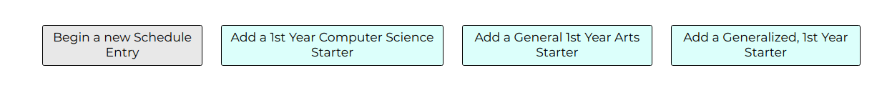

**Test this**: Blank Starter 
1. Out of the options in the image above, choose "Begin a new Schedule Entry"
2. Fill the text field with "Unnamed schedule" with "test" and hit enter
3. Click the green "Add term" button
4. Fill the term name to be "Term one" and click "Save new Label"

**Expect this**: 
The following schedule should be generated:
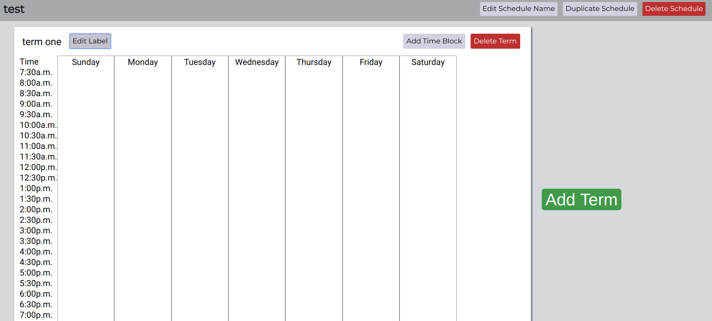


**Test this**: 1st Year Computer Science Degree
1. Out of the options in the image above, choose "Add a 1st Year Computer Science Starter"

**Expect this**: 
The following schedule should be generated
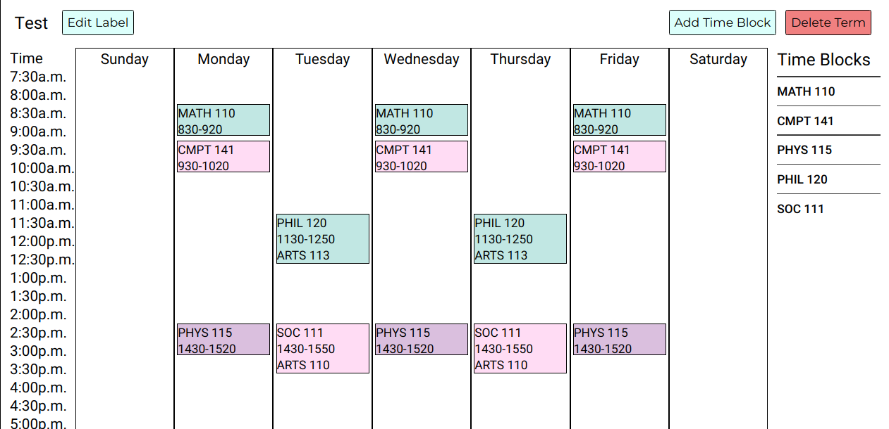
It will have the above term one
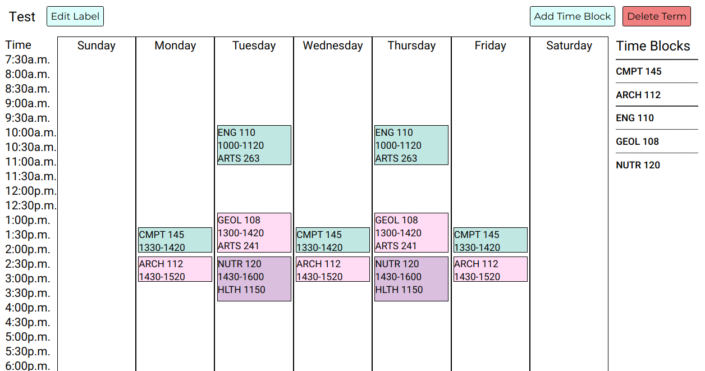
It will have the term two above beside term one

**Test this**: General 1st year arts starter 
1. Out of the options in the image above, choose "Add a General 1st Year Arts Starter"

**Expect this**: 
The following schedule should be generated
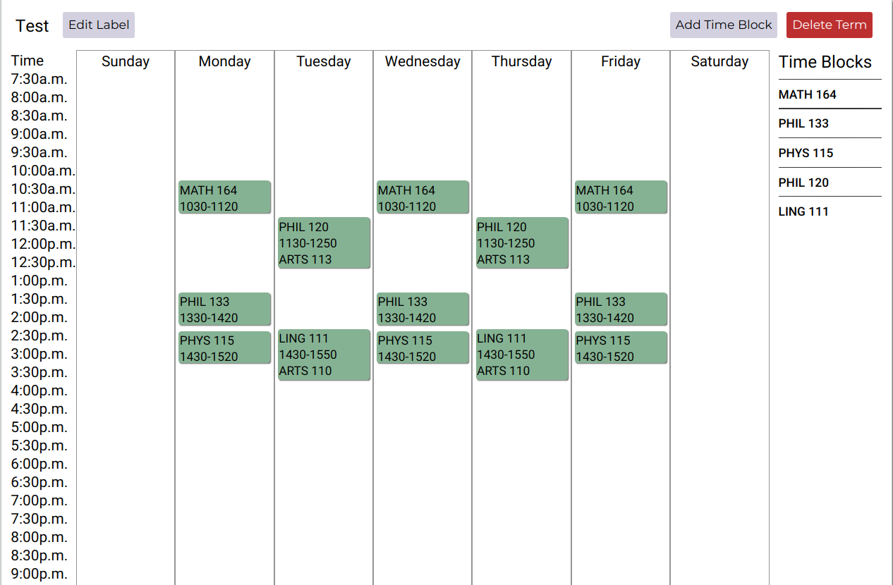
It will have the above term one
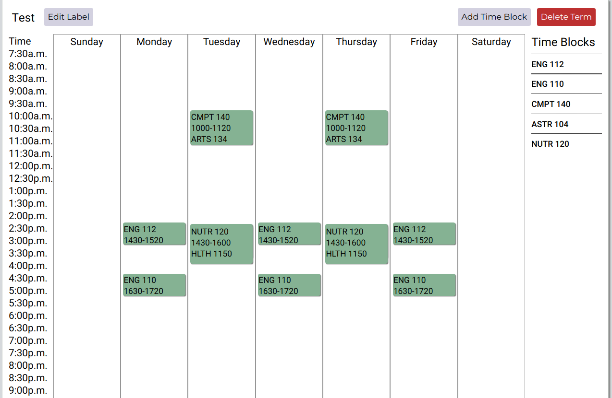
It will have the term two above beside term one

**Test this**: General 1st year starter 
1. Out of the options in the image above, choose "Add a Generalized 1st Year Arts Starter"

**Expect this**: 
The following schedule should be generated
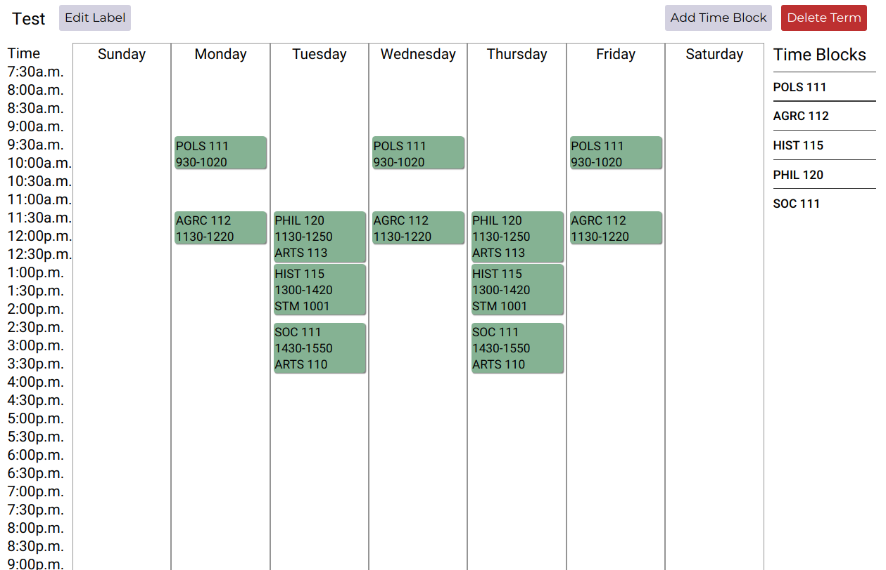
It will have the above term one
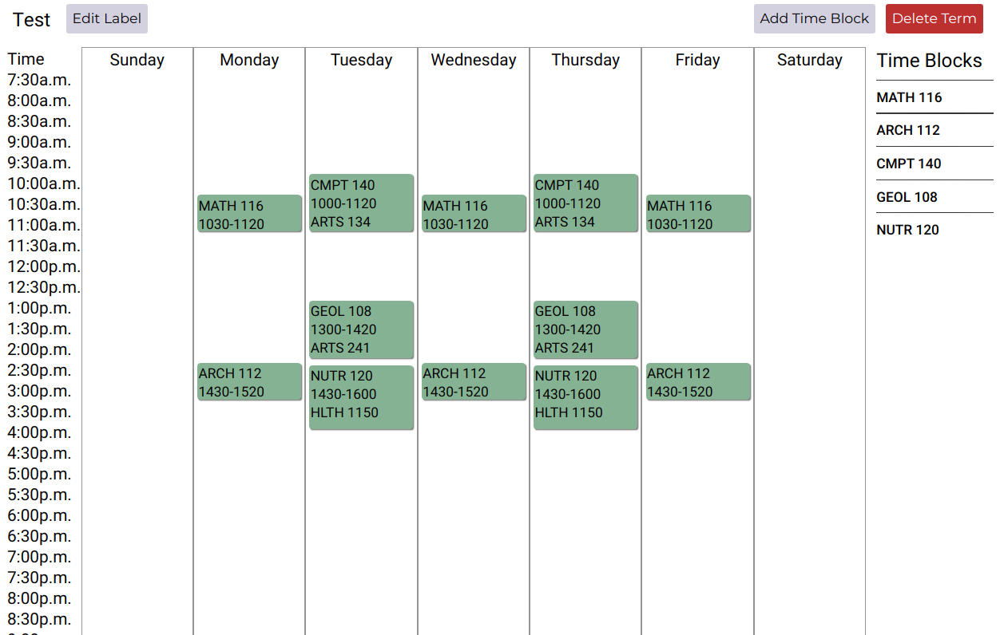
It will have the term two above beside term one

## Searching For Programs
Partial Testing for Medium Priority User Story 1 and High Priority User Story 4
These tests can be done one after another without going back to the default page

1. First open up a black schedule, name it and hit enter. You should see the below boxes

This is the search box:
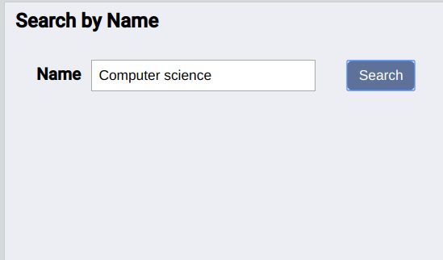

This is the results box:
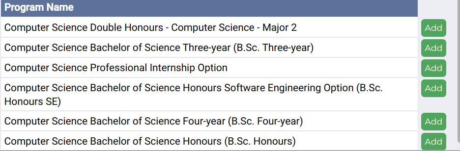

**Test this**: Searching with an empty field
1. Make sure the "Name field" is empty
2. Click the blue search button

**Expect this**: 
The first 100 of all the programs will show up in the results box starting with 
"Classical, Medieval and Renaissance Studies Bachelor of Arts Double Honours (B.A. Honours) - Classical, Medieval and Renaissance Studies - Major 2" 
and "Drama Bachelor of Arts Double Honours (B.A. Honours) - Drama - Major 2"

**Test this**: Searching for Computer Science degrees only
1. Type "Computer Science" in the the "Name" search field
2. Click the blue search button

**Expect this**: 
In the results box the six computer science degrees will show up starting with
"Computer Science Double Honours - Computer Science - Major 2"
"Computer Science Bachelor of Science Three-year (B.Sc. Three-year)"

**Test this**: Searching with subject only to find math degrees
1. Type "Math" in the the "Name" search field
2. Click the blue search button

**Expect this**: 
In the results box the 10 math degrees will be listed starting with
"Mathematics Bachelor of Science Double Honours - Mathematics - Major 1"
"Mathematics Minor"

**Test this**: Searching with a subject that does not exist
1. In the search box change 'math' to 'maths'
2. Click Search

**Expect this**: 
Nothing should show up in the search results box

**Test this**: Searching for Computer Science Degrees with "CMPT" ie the subject code
1. In the search box change 'maths' to 'cmpt'
2. Click search 

**Expect this**: 
Nothing should show up as we do not support searching by subject code

**Test this**: Searching for math degrees with incorrect spelling
1. In the search box change "cmpt" to "mateh" 
2. Click search 

**Expect this**: 
Nothing should show up in the results box

**Test this**: Searching with partial degree name out of order
1. Type ""Science Honours - Mathematics - Major 1"" in the the "Name" search field
2. Click the blue search button

**Expect this**: 
You should have two results, "Mathematics Bachelor of Science Double Honours - Mathematics - Major 1" and "Mathematics Bachelor of Science Double Honours - Mathematics and Statistics - Majors 1 and 2"

## Editing Classes
Testing for High Priority 1 User Story
These tests can be done one after another without going back to the default page

**Test this**: Add a class on one day
1. Create a new schedule by clicking the buttom "Begin a new Schedule Entry"
2. Fill the text field with "Unnamed schedule" with "test" and hit enter
3. Click the green "Add term" button
4. Fill the term name to be "Term one" and click "Save new Label"
5. Search for classes using subject = "math" and professor = "rayan"
6. Scroll through the results to find MATH 450
7. Click the green add button beside the class
8. A blue bar will pop up below the class searcher with options of where to put the class, click "test"
9. Click "Term one'
10. Click "Quit"

**Expect this**: 
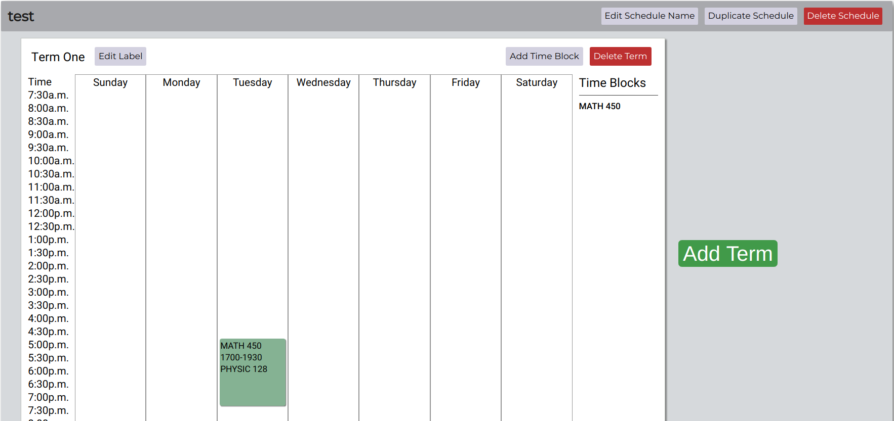

**Test this**: Add a class twice
1. Go back to the search results from the previous test and try to click add again to add MATH 450 to the schedule

**Expect this**: 
Nothing should have changed and the site should not crash

**Test this**: Delete a class that is on one day
1. Find the list of time blocks in the schedule. It will be right beside the column for saturday. 
2. Hover over MATH 450
3. A breif description should appear below the class with a red delete button
4. Click the 'delete' button

**Expect this**: 
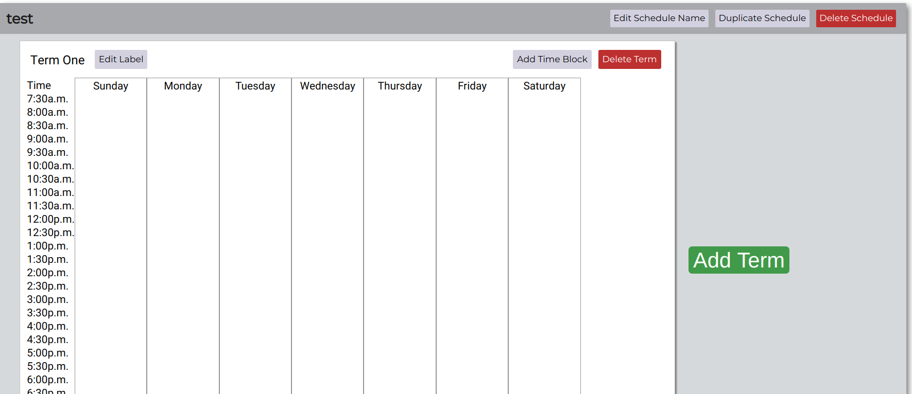

**Test this**: Add a class on MWF
1. Go the search results from the first test and find the first entry of MATH 276
2. Click add
3. In the blue bar below the class searcher, click "test" and then "term one"
4. Click "quit"

**Expect this**: 
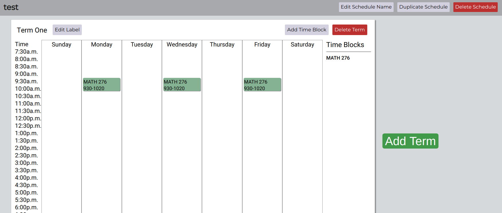

**Test this**: Add a new class that overlaps with another one
1. Change the search field to only have Subject = "cmpt". All other search fields should be blank
2. Scroll through the search results untill you find the first CMPT 140 entry from 900 to 1050. 
3. Click add
4. In the blue bar below the class searcher, click test, term one and then quit


**Expect this**: 
The class will not show up as we don't allow overlaps

**Test this**: Delete a class that is on multiple days
1. Find the list of time blocks in the schedule. It will be right beside the column for saturday. 
2. Hover over MATH 276
3. A breif description should appear below the class with a red delete button
4. Click the 'delete' button

**Expect this**: 
The class MATH 276 should be deleted on every day

**Test this**: Add multiple classes to one term
1. Delete all class currently on the schedule
2. Search for classes using subject = "math" and professor = "rayan"
3. From the search results from the last test click add on MATH 164
4. In the blue bar below the class searcher, click term one
5. Click add on the first MATH 277 class
6. In the blue bar below the class searcher, click term one
7. Click add on the MATH 450 class
8. In the blue bar below the class searcher, click term one
9. Click add on the first MATH 276 class
10. In the blue bar below the class searcher, click term one

**Expect this**: 
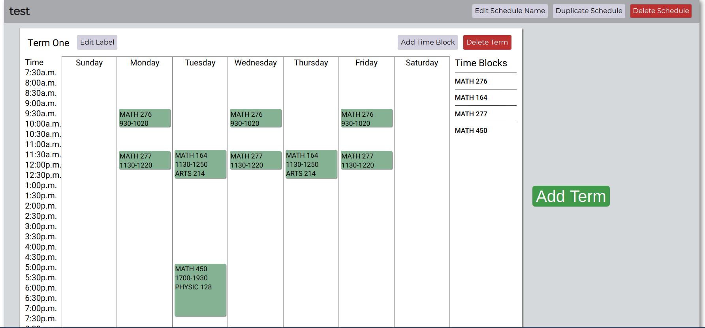

**Test this**: Delete a class from a term and add it to a new term
1. Find the list of time blocks in the schedule. It will be right beside the column for saturday. 
2. Hover over MATH 450
3. A breif description should appear below the class with a red delete button
4. Click the 'delete' button

**Expect this**: 
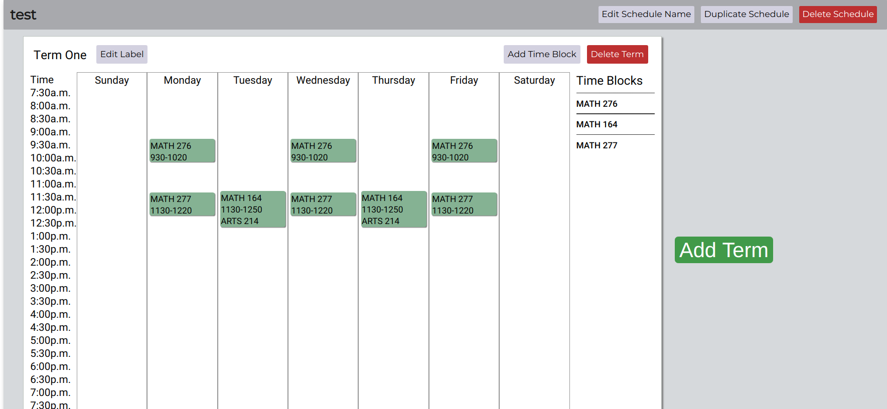

**Test this**: Create a term
1. Click the green "add term" button next to the first term
2. Fill in 'Term Name' text field that just popped up with term two
3. Hit enter

**Expect this**: 
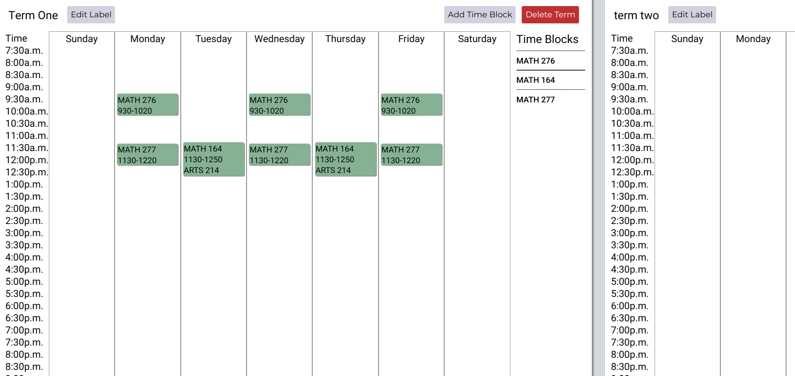

**Test this**: Delete a class from a term and add it to a new term
1. Find the list of time blocks in the schedule. It will be right beside the column for saturday. 
2. Hover over MATH 450
3. A breif description should appear below the class with a red delete button
4. Click the 'delete' button
3. Click 'cancel add' on the blue bar below the class searcher
3. Click add on the MATH 450 class
4. In the blue bar below the class searcher, click term two

**Expect this**: 
MATH 450 should now be in term two and NOT term one.

## Editing Time Blocks
Testing for High Priority 2 User Story
These tests can be done one after another without going back to the default page

**Test this**: Add the default time block
1. From the base page, click "Begin a new Schedule Entry"
2. Fill the text field with "Unnamed schedule" with "test" and hit enter
3. Click the green "Add term" button
4. Fill the term name to be "Term one" and click "Save new Label"
5. Click the "Add Time Block" at the top of the schedule right next to the red "Delete Term" button
6. Click "Submit Block"

**Expect this**: 
Nothing will happen as we require a title

**Test this**: Add default time block with title specified 
1. After doing the above steps, fill in the "Event Title" text field with "Block One" 
2. Click "Submit Block"

**Expect this**: 
Nothing will happen as we require a day

**Test this**: Add default time block with day specified 
1. After doing the above steps, click tues as the day for the time block
2. Click "Submit Block"

**Expect this**: 
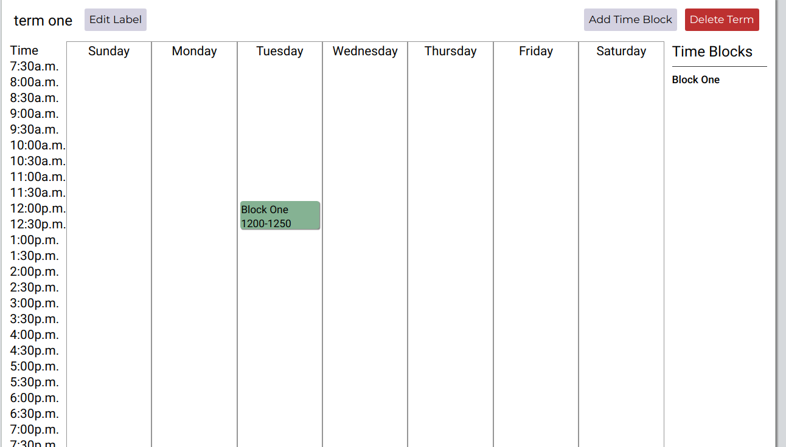

**Test this**: Add time block with an invalid time block
1. Click the "Add Time Block" at the top of the schedule right next to the red "Delete Term" button
2. Enter the title: "Block Two"
3. Change the start time to 13:00 DO NOT CHANGE END TIME
4. Specify the day to be tuesday
5. Click "Submit Block"

**Expect this**: 
Nothing will happen as the time is invalid. The site should not crash

**Test this**: Add a time block that comes directly after another time block
1. After the steps above, change the end time to be 13:00
2. Click "Submit Block"

**Expect this**: 
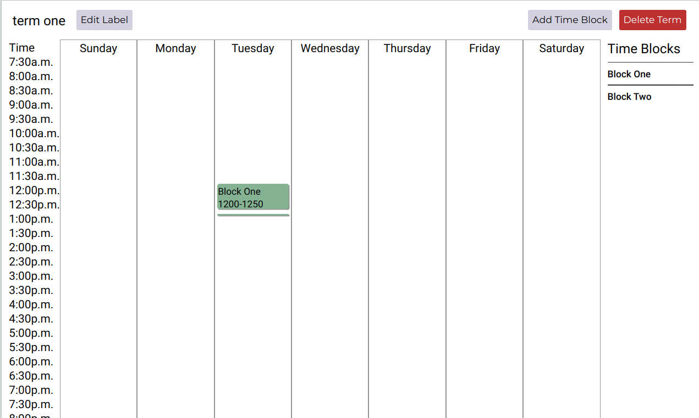

**Test this**: Delete a time block that is only on one day
1. Hover over "Block One" under Time Blocks
2. Click "Delete"

**Expect this**: 
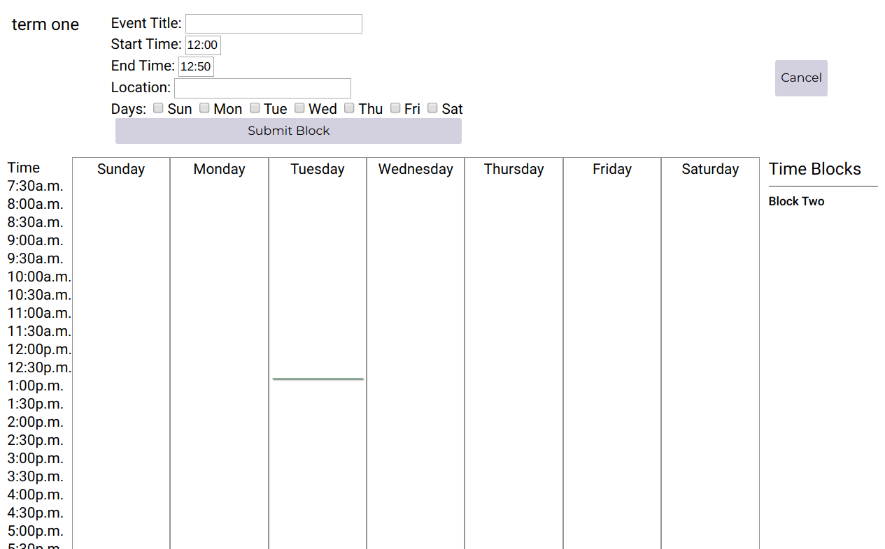

**Test this**: Add default time block that overlaps an existing timeblock
1. Click the "Add Time Block" at the top of the schedule right next to the red "Delete Term" button
2. Enter the title: "Block Three"
3. Change the start time to 12:00
4. Change the end time to be 14:00
5. Specify the day to be tuesday
6. Click "Submit Block"

**Expect this**: 
Nothing will happen as we don't allow overlap

**Test this**: Add time block with specified name and location on two days 
1. Click the "Add Time Block" at the top of the schedule right next to the red "Delete Term" button
2. Enter the title: "Block Four"
3. Specify the day to be Monday, Wednesday, Friday
5. Click "Submit Block"

**Expect this**: 
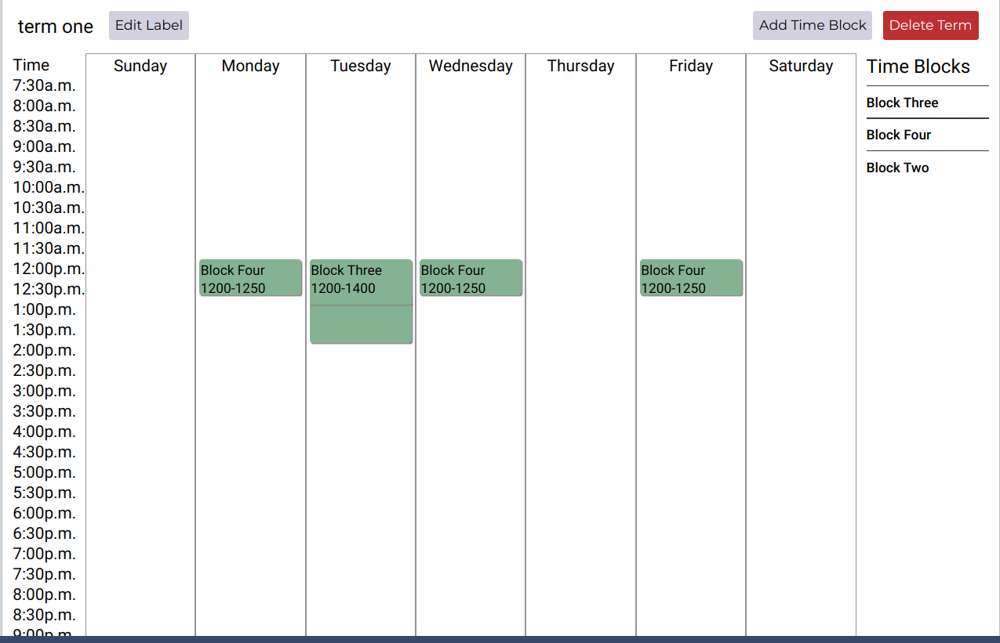

**Test this**: Delete a time block that is on multiple days 
1. Hover over "Block Four" under "Time Blocks"
2. Click "Delete"

**Expect this**: 
Block four should be deleted. ie not on the schedule or listed under time blocks

**Test this**: Delete a time block that is on one day
1. Hover over "Block Two" under "Time Blocks"
2. Click "Delete"

**Expect this**: 
A blank schedule and no time blocks listed

## Choosing Programs
Testing for High Priority 4 User Story and Medium Priority 1 User Story
These tests can be done one after another without going back to the default page 

**Test this**: Add only a minor
1. Out of the options in the image above, choose "Begin a new Schedule Entry"
2. Fill the text field with "Unnamed schedule" with "test" and hit enter
3. Click the green "Add term" button
4. Fill the term name to be "Term one" and click "Save new Label"
5. In the program box below the term, find the program searcher box.
6. Type "Math" into the "Search by name" name field. 
7. Click the blue search button
8. Find the second result: "Mathematics Minor" and click the add button beside it

**Expect this**: 
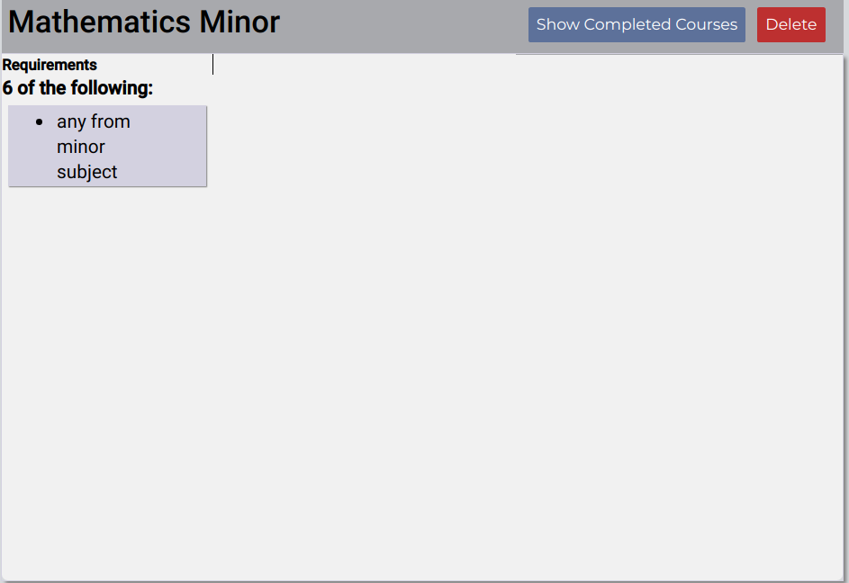

**Test this**: Remove a minor
1. Find the red "Delete" button beside "Show Completed Courses" and "Mathematics Minor"
2. Click it

**Expect this**: 
The program "Mathematics Minor" box should disappear

**Test this**: Add a Mathematics degree
1. Find the third result from searching for math as in the earlier step
2. click the green "add" button beside "Mathematics Bacheolor of Science Four-Year (B.Sc. Four-year"

**Expect this**: 
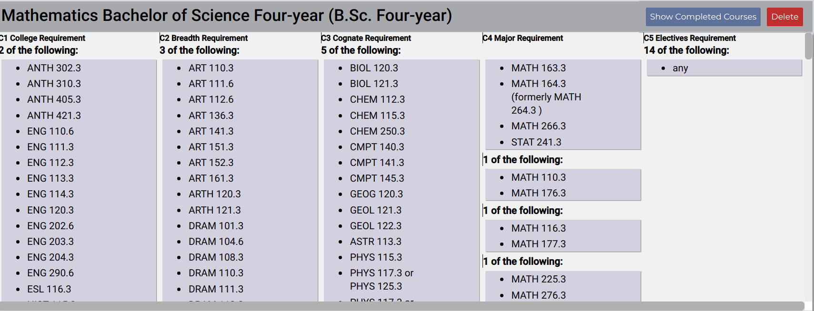
The requirements should match up with the requirements here
https://programs.usask.ca/arts-and-science/mathematics/bsc-4-math.php#C1CollegeRequirement9creditunits

**Test this**: Add a minor to a degree
1. Go back to the program searcher and type "phy" in to the search by "name" field
2. Click the green "Add" button on the third result: "Physics Minor"

**Expect this**: 
The following block should appear below the "Mathematics Bachelor of Science" program
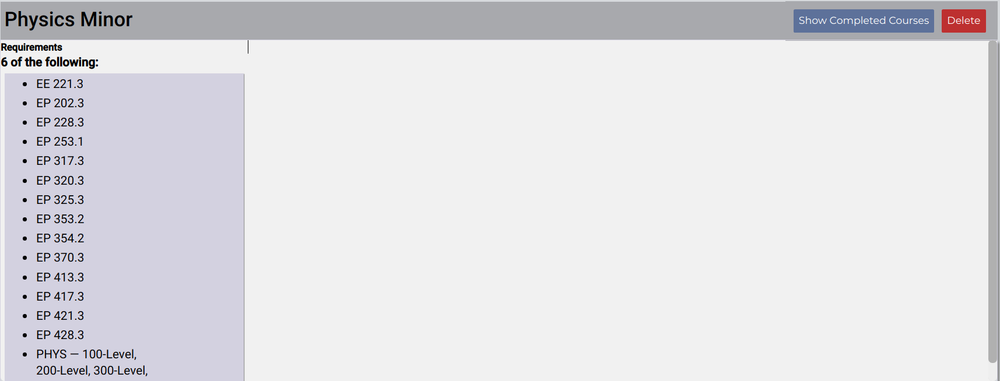

**Test this**: Remove a degree
1. Find the red "Delete" button beside "Show Completed Courses" and "Mathematics Bachelor of Science"
2. Click it

**Expect this**: 
The Mathematics program should disappear, but the minor program should stay

**Test this**: Add an honours degree
1. Go back to the program searcher and type "computer" in to the search by "name" field
2. Click the green "Add" button on the last result: "Computer Science Bachelor of Science Honours - Computer Science - Major 2"

**Expect this**: 
Expect the following box to appear below the Physics minor one
The requirements should match up with: https://programs.usask.ca/arts-and-science/computer-science/bsc-double-honours-computer-science-major-2.php#Requirements42creditunits
The 0.33333 error is an error that was carried over from the data we scrapped from the paws website
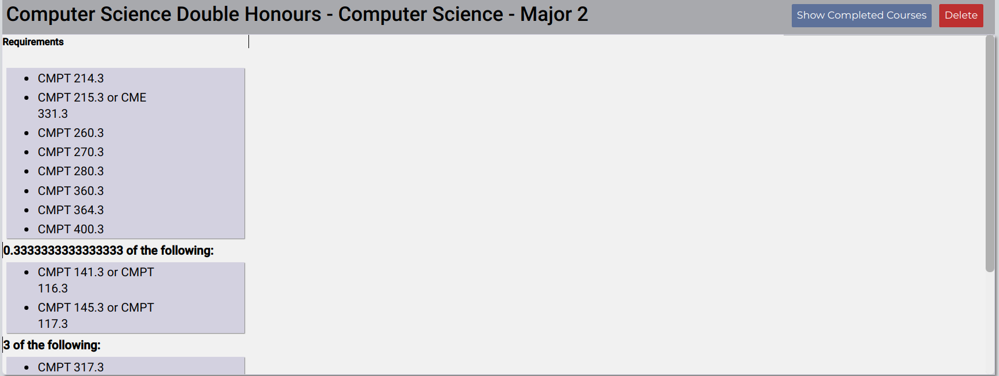

**Test this**: Add the primary honours degree
1. Go back to the program searcher and type "math" in to the search by "name" field
2. Click the green "Add" button on the first result: "Mathematics Bachelor of Science Double Honours - Mathematics - Major 1"

**Expect this**: 
The program should match up with: https://programs.usask.ca/arts-and-science/mathematics/bsc-dbl-honours-math-major1.php


**Test this**: Delete one honours degree
1. Find the red "Delete" button beside "Show Completed Courses" and "Computer Science Double Honours - Computer Science - Major 2"
2. Click it

**Expect this**: 
Only the Computer Science Double Honours Major 2 program should disappear


**Test this**: Delete the test term
1. Scroll up to the test term. Find the "Delete Schedule" red button
2. Click it

**Expect this**: 
All programs should disappear

## Program Verification
Testing for High Priority 4 User Story and Medium Priority 1 User Story
These tests can be done one after another without going back to the default page 

**Test this**: Test starter schedule validation 
1. Click the green "Add a 1st Year Computer Science Starter"
2. In the program searcher box below the terms, type "Comp" into the "Name" search field
3. Click "Search"
4. Click the second green "add" button for "Computer Science Bachelor of Science Three-year (B.Sc. Three-year)"

**Expect this**: 
The requirements should match up with: https://programs.usask.ca/arts-and-science/mathematics/bsc-dbl-honours-math-major1.php
In the program requirements the following should be crossed out and in green:
ENG 110.6, PHYS 115.3, PHIL 120.3, ENG 110.6, MATH 110.3, PHIL 120.3, ARCH 112.3, SOC 111.3, CMPT 140, CMPT 145

**Test this**: Test adding a class
1. In the search box, type 'cmpt" into the "Search by subject field"
2. type "214" into the "Search by class"
3. Click Search
4. Add the third result, the CMPT214 class from 1600 to 1720

**Expect this**: 
CMPT 214 should now also be crossed out in the requirements box

**Test this**: Test removing a class
1. Find the list of time blocks in the schedule. It will be right beside the column for saturday. 
2. Hover over MATH 110
3. A breif description should appear below the class with a red delete button
4. Click the 'delete' button

**Expect this**: 
MATH110 should no longer be crossed out in the requirements box

**Test this**: Test having two requirements
1. Find the program searcher and search for "math"
2. Click "add" on the third option for "Mathematics  Bachelor of Science Four-year (B.Sc. Four-year)"

**Expect this**: 
Classes should be crossed out in both programs.

## Editing and Duplicating Schedules
Testing for Medium Priority 2 User Story

**Test this**: Duplicate a blank schedule
1. From the base page, click "Begin a new Schedule Entry"
2. Fill the text field with "Unnamed schedule" with "test" and hit enter
3. Click the green "Add term" button
4. Fill the term name to be "Term one" and click "Save new Label"
5. Find the "Duplicate Schedule" Button right next to the red "Delete Schedule" button and click it
6. Scroll down to the bottom of the page to find the new text field with "Unnamed schedule"
7. Enter a name and hit enter

**Expect this**: 
You'll now have two blank schedules. Notice that for the second schedule you did not need to add a term. It had one to start with

**Test this**: Duplicate a schedule with only classes
1. Out of the options in the image above, choose "Add a Generalized 1st Year Arts Starter"
2. Find the "Duplicate Schedule" Button right next to the red "Delete Schedule" button and click it

**Expect this**: 
If you scroll down you should now have two schedules with the exact same classes.

**Test this**:  Test modifying the original
1. Using the schedules from the last step do the following
2. Search for classes using only subject = "math"
3. Add math 102 on Thursday. It is the class with the little moon beside the start time
4. Select the first "Starter Schedule" in the blue bar below the class searcher
5. Click "Fall Term"

**Expect this**: 
You should now have a class in the orginal term one of the stater schedule and not the duplicate

**Test this**:  Test modifying the duplicate
1. Using the schedules from the last test step do the following
2. Add the first math 102 on MTWRF
4. Select the second "Starter Schedule" in the blue bar below the class searcher
5. Click "Fall term"

**Expect this**: 
You should now have a class in the duplicate term one of the stater schedule and not the original

**Test this**: Delete the first term
1. Using the schedules from the last tests find the first schedule
2. Find the "Delete Term" Button in the first term and click it

**Expect this**: 
It should be deleted and you should be left with the second term. The other schedule should not be affected

**Test this**: Delete the second term
1. Using the schedules from the last tests, scroll down to the second schedule
2. Find the "Delete Term" button in the second term and click it

**Expect this**: 
That term should be deleted and you should be left with the first term only. The other schedule should not be affected.

**Test this**: Delete the first schedule
1. Using the schedules from the last tests, find the first schedule
2. Find the "Delete Schedule" button and click it

**Expect this**: 
That schedule should be deleted and you should be left with the second schedule only.

**Test this**: Delete the last schedule
1. Using the schedules from the last tests, find the the second schedule
2. Find the "Delete Schedule" button and click it

**Expect this**: 
There should be no more schedules left

# Speed/Performance Testing 
**Image results sourced from Virtual Machine**

The ideal way to test the Speed and Performance is to use your browser's included webdeveloper tools included in major browsers.
## Accessing benchmarking tools in Google Chrome/Chromium
hit *F12* to activate the elements view, from there you can check the *Performance* tab which let's you profile the time it takes to perform interactions, draw new objects or complete a page load.

Here we can see that the time to load the page was *267ms*, a good result for us is a page load time below *400ms*.

*Memory* allows you to perform similar tests while checking that Garbage Collection is operating normally.

Here I took a snapshot on pageload(*Snapshot 1*) and one after adding a few schedules, to demonstrate that the amount of memory use by the page will increase during use.
As long as the memory increases linearly with the introduction of more web elements memory use is normal.

The *Audits* tab is especially useful for comparing our product with expected performance among other webapps.

Without dedicating time to optimization our goal is to keep our performance score above 60.

## Accessing benchmarking tools in Mozilla Firefox
To open up Firefox's elements view hit *Shift+F5* 

*Network* Is a responsiveness test that works for page load and other GET API requests.


under *500ms* seems to be a good timing for the DOMContentLoaded to receive the page contents and display.

*Performance* lets you profile the webpage and see which events cause major slowdowns in frames per second.

This view lets you look at the site's performance over time. In the images case a reload was requested and there is a notable slowdown while the page loads.

*Memory* Allows you to take a snapshot of the memory that has been currently allocated by the web page.

Snapshot 1 demonstrates the state of memory after a page load and Snapshot 2 shows what happens when schedule objects are added.


# Back End Testing 

## Database Quality
For this test set we assume that you are viewing the project via the virtual machine, however it is very similar to do if it is running on your own machine. For these tests it is insufficient to log into the "user" of the VM since they don't have sudo permission. You could log into any of the but the easiest to work with is dev4.

Log into the VM from your own machine with
```shell script
ssh nsid@tuxworld.usask.ca
ssh dev4@CMPT370g3.usask.ca
```

When here go to the "370-project" directory then run a docker command to that scans through the database and checks for any suspicious behaviour
```shell script
cd ./370-project
sudo docker-compose run web python manage.py test
``` 
Here "test" is a custom command that does the following.

First it gets the number of entries in each table, and compares this against the number of entries that are expected. This ensures that there is no data missing, and no more than the ones that were scraped.

Next it checks for duplicate entries in every table. There should be no duplicate classes, professors, etc and this ensures that.

The last thing it does is check a few predetermined random lines from the database are actually in the database so that we know that the data we know is correct hasn't changed

## API Quality
For this test we still need to be in the virtual machine. We can do this from the "user" user, but the code is in dev4 so again it is simplest to login to that. These tests assume that the servers are running somewhere in the background.

From your desktop get to the VM with
```shell script
ssh nsid@tuxworld.usask.ca
ssh dev4@CMPT370g3.usask.ca
```

Navigate to the "tests" directory with:
```shell script
cd ~/370-project/newDjango/tests
```
Then run the API tests with
```shell script
python classApiTest.py
python programApiTest.py
```

These tests check the correctness and functionality of the API including the following.

Whether the API will give results at all when different parameters are passed to it. This ensures that each of the parameters actually work.

Whether the API will return a specific class in it's search results when it should

